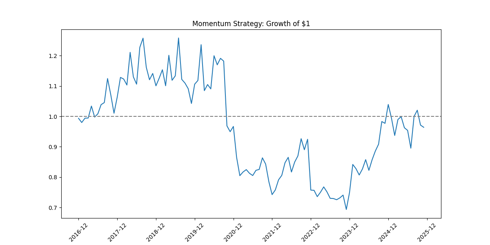

# Momentum Factor Model

Backtesting the classic momentum strategy on S&P 500 stocks (2016-2025).

## Overview

This project implements the well-documented momentum factor: stocks that have performed well recently tend to continue performing well, and vice versa. The strategy ranks all S&P 500 stocks by their trailing 11-month returns (skipping the most recent month to avoid short-term reversal), then goes long the top decile and short the bottom decile.

## Key Findings
The classic long-short momentum strategy produced a -0.11 Sharpe with 45% max drawdown — worse than holding cash. However, long-only momentum achieved 0.93 Sharpe with only 21% drawdown, nearly matching SPY (1.02 Sharpe during bull-market, w/ 24% max drawdown). The short leg destroyed value in a bull market, demonstrating why many practitioners prefer long-only factor tilts over market-neutral approaches.
- **Pre-COVID (2016-2020):** Strategy worked as expected, compounding to ~$1.25 on $1 invested
- **March 2020:** Momentum crash — the strategy suffered a ~45% drawdown as market leadership violently reversed
- **Post-COVID:** Strategy struggled to recover, demonstrating tail risk
- **Long-only variant:** Simply holding winners (no short position) returned ~6x over the period
- **Increasing sample universe:** Increasing from 500 to 2,500 stocks only created noise and flooded model with bad data, and needs further investigation into the data-cleanup

This matches academic research on momentum: it works until it doesn't, and when it fails, it fails hard at market inflection points.

## Methodology

1. **Data:** Daily price data for S&P 500 for last 10 years constituents pulled via yfinance, converted to monthly
2. **Momentum signal:** 11-month cumulative return, lagged by 1 month
3. **Portfolio construction:** Rank stocks into deciles each month; long top decile, short bottom decile
4. **Rebalancing:** Monthly

## Files

- `momentum.ipynb` — Main notebook with data pull, analysis, and visualizations
- `requirements.txt` — Python dependencies

## Setup

```bash
# Clone the repo
git clone https://github.com/Caden-Ramsey/momentum-factor-model.git
cd momentum-factor-model

# Create virtual environment
python3 -m venv venv
source venv/bin/activate  # On Windows: venv\Scripts\activate

# Install dependencies
pip install -r requirements.txt

# Run the notebook
jupyter notebook momentum.ipynb
```

Note: The initial data pull takes ~3 minutes for 500 stocks × 10 years of daily data, depending on WiFi connection.

## Results



## Lessons Learned

- **Momentum crashes are severe:** The COVID reversal wiped out years of gains in weeks
- **Data quality matters:** Attempted to expand to Russell 3000 but encountered survivorship bias and garbage data that overwhelmed the signal
- **Long-only outperformed:** In a bull market, the short leg is a drag — you're paying for insurance you don't need

## Future Improvements

- Industry-neutral momentum (rank within sectors to avoid concentration)
- Further data-quality filtering and standardization
- Multi-factor model combining momentum with value or quality
